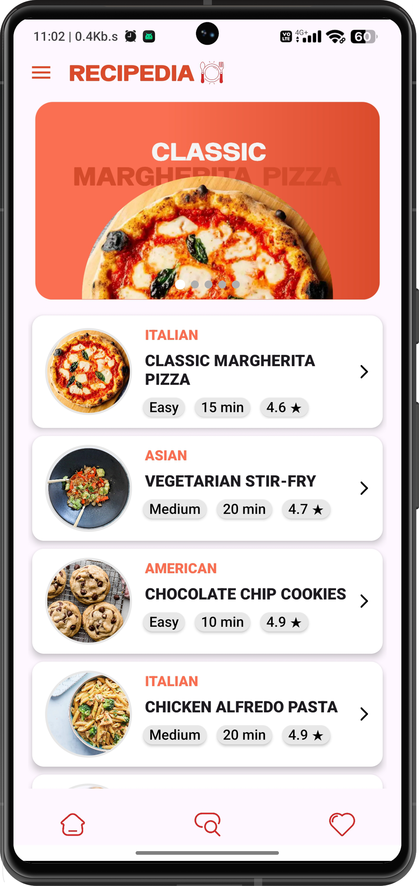
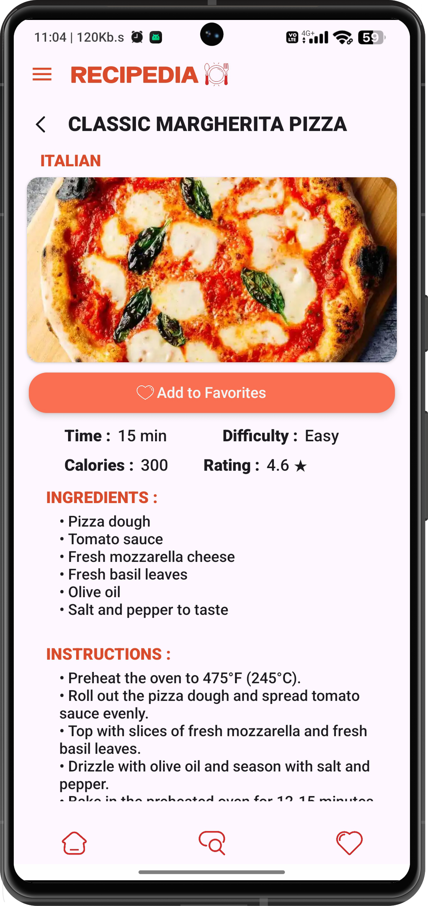
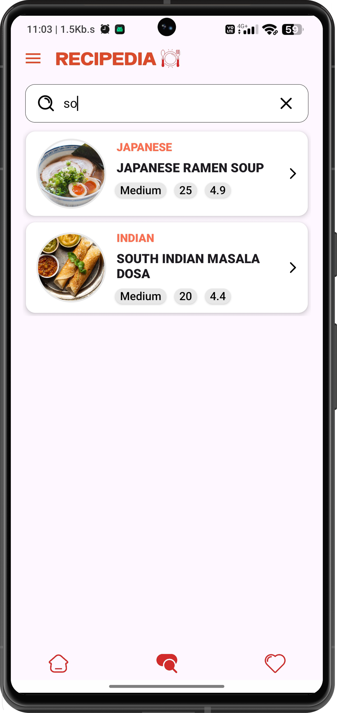
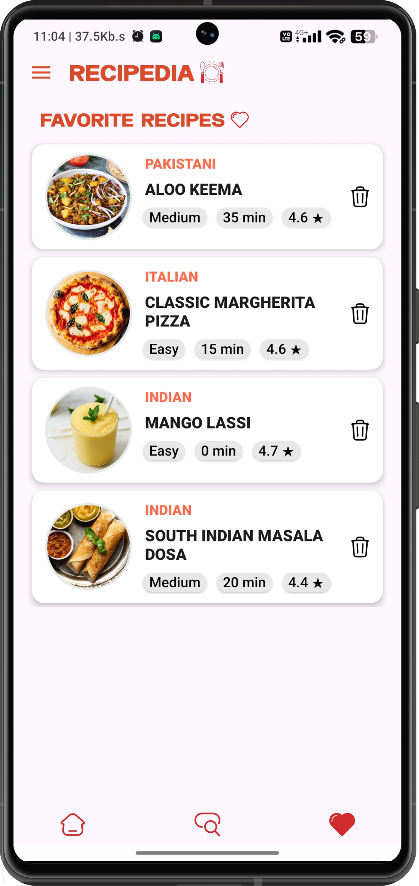

.png)
# 🍲Recipedia - Android Recipe Application 

## 📜 Description

Recipedia is a mobile application that lets users explore, search, and save their favorite recipes with ease. Built with Kotlin and powered by Firebase 🔥 and the DummyJSON API, the app provides an interactive and personalized cooking experience.

## ✨ Features and Functionality

*  🍽️ **Browse Recipes :** View a curated list of recipes fetched from a remote API.
*  🔍 **Search Recipes :** Find specific recipes by name using a custom search view.
*  📖 **View Recipe Details :** Tap on a recipe to see detailed information, including ingredients and instructions.
*  ❤️ **Save Favorite Recipes :** Authenticated users can save recipes to their favorites list, stored in Firebase Realtime Database.
*  👤 **User Authentication :**  Sign-up and login functionality using Firebase Authentication.
*  🧭 **Navigation :** Bottom navigation bar for quick access to Home, Search, and Favorites. Navigation drawer for accessing the same features as well as logout.
*  🖼️ **Image Slider :**  Display a rotating carousel of featured recipe images on the home screen.
*  🔔 **Notifications :** Receive a notification when a recipe is added to your favorites.

## 📸 Screenshots

<p align="left">
  
  
  
  
</p>

## 🛠️ Technology Stack

*  💻 **Kotlin:** Primary programming language for Android development.
*  📱 **Android SDK:**  Platform for building the Android application.
*  🧩 **Android Jetpack:** Set of libraries to help build robust, testable, and maintainable apps (e.g., `Fragment`, `RecyclerView`, `ViewBinding`).
*  🌐 **Retrofit:**  HTTP client library for making network requests to the dummyjson.com API.
*  📦 **Gson:**  JSON library for serializing and deserializing data.
*  🖼️ **Picasso:**  Image loading and caching library.
*  🔥 **Firebase Authentication:** User authentication service.
*  ☁️ **Firebase Realtime Database:**  Cloud-based NoSQL database for storing user favorites.
*  🎠 **ImageSlider:** Third party library used to implement Image Slider.

## 📋 Prerequisites

*  🛠️ Android Studio installed.
*  🔥 A Firebase project set up with Authentication and Realtime Database enabled.
*  📱 An Android device or emulator to run the application.

## ⚙️ Installation Instructions

1.  **Clone the Repository :**

    ```bash
    git clone https://github.com/harshstr14/Recipe-App.git
    cd Recipe-App
    ```

2.  **Open the Project in Android Studio :**

    *   Open Android Studio.
    *   Select "Open an Existing Project" and navigate to the cloned repository.

3.  **Configure Firebase :**

    *   Go to your Firebase project in the Firebase Console.
    *   Add Firebase to your Android app by following the instructions in the console.
    *   Download the `google-services.json` file and place it in the `app/` directory of your project.

4.  **Update `build.gradle` Files :**

    *   **`build.gradle (Project: Recipe-App)`:**

        ```gradle
        plugins {
            id 'com.android.application' version '8.2.2' apply false
            id 'org.jetbrains.kotlin.android' version '1.9.0' apply false
            id 'com.google.gms.google-services' version '4.4.0' apply false
        }
        ```

    *   **`build.gradle (Module: app)`:**

        ```gradle
        plugins {
            id 'com.android.application'
            id 'org.jetbrains.kotlin.android'
            id 'com.google.gms.google-services'
        }

        android {
            namespace 'com.example.recipedia'
            compileSdk 34

            defaultConfig {
                applicationId "com.example.recipedia"
                minSdk 24
                targetSdk 34
                versionCode 1
                versionName "1.0"

                testInstrumentationRunner "androidx.test.runner.AndroidJUnitRunner"
            }

            buildTypes {
                release {
                    minifyEnabled false
                    proguardFiles getDefaultProguardFile('proguard-android-optimize.txt'), 'proguard-rules.pro'
                }
            }
            compileOptions {
                sourceCompatibility JavaVersion.VERSION_1_8
                targetCompatibility JavaVersion.VERSION_1_8
            }
            kotlinOptions {
                jvmTarget = '1.8'
            }
            buildFeatures {
                viewBinding true
                buildConfig = true
            }
        }

        dependencies {

            implementation 'androidx.core:core-ktx:1.12.0'
            implementation 'androidx.appcompat:appcompat:1.6.1'
            implementation 'com.google.android.material:material:1.11.0'
            implementation 'androidx.constraintlayout:constraintlayout:2.1.4'
            implementation 'androidx.navigation:navigation-fragment-ktx:2.7.6'
            implementation 'androidx.navigation:navigation-ui-ktx:2.7.6'
            testImplementation 'junit:junit:4.13.2'
            androidTestImplementation 'androidx.test.ext:junit:1.1.5'
            androidTestImplementation 'androidx.test.espresso:espresso-core:3.5.1'

            //Retrofit
            implementation 'com.squareup.retrofit2:retrofit:2.9.0'
            implementation 'com.squareup.retrofit2:converter-gson:2.9.0'

            //Firebase
            implementation(platform("com.google.firebase:firebase-bom:32.7.1"))
            implementation 'com.google.firebase:firebase-analytics-ktx'
            implementation 'com.google.firebase:firebase-auth-ktx'
            implementation 'com.google.firebase:firebase-database-ktx:20.3.0'

            //Image Loader
            implementation 'com.squareup.picasso:picasso:2.8'
            implementation 'de.hdodenhof:circleimageview:3.1.0'

            //ImageSlider
            implementation("com.github.denzcoskun:ImageSlider:1.2.1")
        }
        ```

5.  **Sync Project with Gradle Files :**

    *   In Android Studio, go to `File > Sync Project with Gradle Files`.

6.  **Build and Run the Application :**

    *   Connect an Android device or start an emulator.
    *   Click the "Run" button in Android Studio.

## 📖 Usage Guide

1.  **👤 Sign Up/Login :**
    *   Launch the application.
    *   If you don't have an account, click on "Sign up" and provide the required information (name, username, email, password, and accept the terms and conditions).
    *   If you already have an account, click on "Login" and enter your email and password.

2.  **🏠 Browse Recipes (Home) :**
    *   The Home screen displays a list of recipes.
    *   Tap on a recipe item to view the details.
    *   A carousel of featured recipes is also displayed at the top.

3.  **🔍 Search Recipes :**
    *   Navigate to the "Search" screen using the bottom navigation bar or the navigation drawer.
    *   Use the `CustomSearchView` to enter your search query.
    *   The recipe list will update dynamically as you type.

4.  **📖 View Recipe Details :**
    *   On the Home or Search screens, tap a recipe to open the `OnclickItem` fragment.
    *   View the recipe's image, cuisine, difficulty, cook time, rating, ingredients, and instructions.
    *   Click the "Favorite" button to add the recipe to your favorites. A notification will confirm the action.

5.  **❤️ Favorites :**
    *   Navigate to the "Favorites" screen using the bottom navigation bar or the navigation drawer.
    *   View a list of your saved recipes.
    *   Tap on a recipe to view its details.
    *   Tap the delete button next to a recipe to remove it from your favorites.

6.  **🚪 Logout :**
     *  Open the navigation drawer.
     *  Select the "Logout" option. You will be redirected to the login page.

## 🌐 API Documentation

This application utilizes the [dummyjson.com](https://dummyjson.com/) API to retrieve recipe data.

*   **Endpoint :** `https://dummyjson.com/recipes`
*   **Method :** `GET`
*   **Response :** Returns a JSON object containing an array of recipe objects.

## 🤝 Contributing Guidelines

Contributions are welcome! To contribute :

1. 🍴 Fork the repository.
2. 🌿 Create a new branch for your feature or bug fix.
3. ✍️ Make your changes and commit them with descriptive commit messages.
4. ⬆️ Push your changes to your forked repository.
5. 🔀 Submit a pull request to the main repository.

## 📜 License Information

⚠️ No license specified. All rights reserved.

## 📧 Contact/Support Information

For questions or support, please contact: harshstr14@gmail.com
